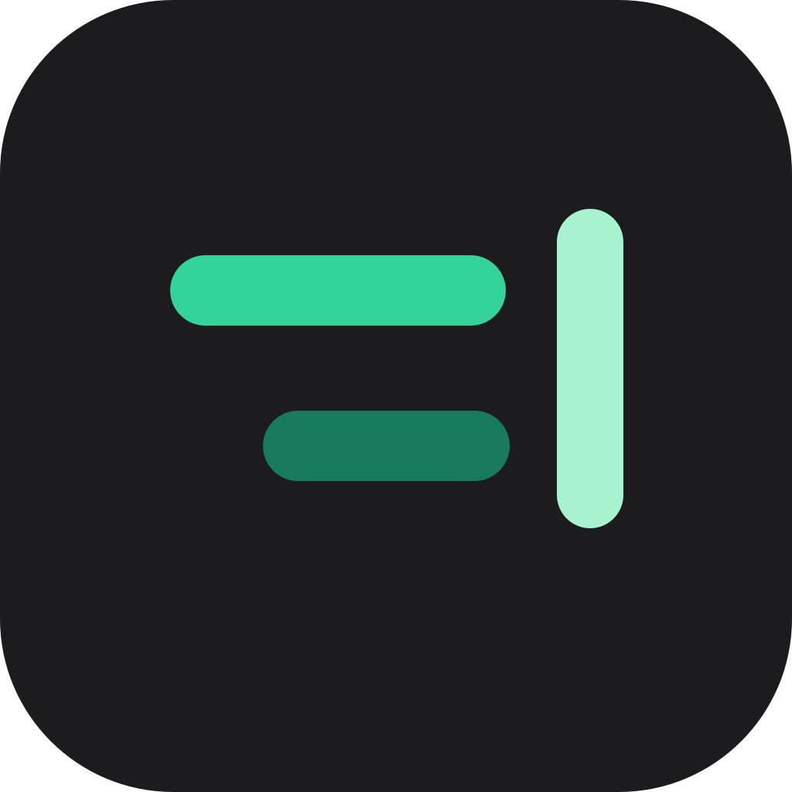
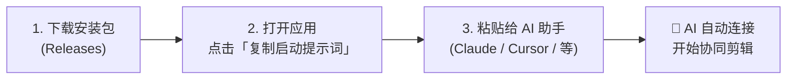
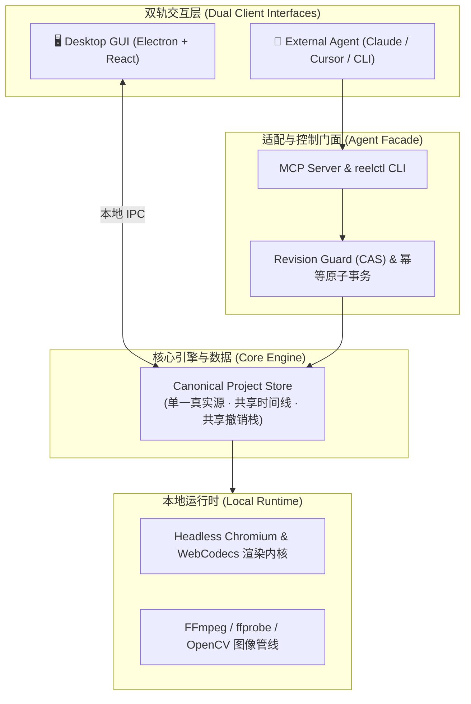

<div align="center">



# ReelTerminal

### 面向 AI 视频生产的人机协同视频剪辑器
**Agent-Native Finishing Video NLE · 生成发生在任何地方，成片交付在这里。**

<p align="center">
  <a href="https://github.com/yuchen-ya/reelterminal/releases"></a>
  <a href="docs/AGENT-GUIDE.md"></a>
  <a href="docs/COMMAND-API.md"></a>
  <a href="docs/EXTERNAL-DEPENDENCIES.md"></a>
  <a href="apps/desktop/DISTRIBUTION.md"></a>
  <a href="LICENSE"></a>
</p>

[**🚀 立即体验**](#-快速开始-quick-start) • [**✨ 核心亮点**](#-核心亮点-core-highlights) • [**🤖 智能体协同**](#-智能体协同-agent-collaboration) • [**🏗️ 架构概览**](#-系统架构-architecture) • [**📚 详细文档**](docs/)

</div>

---

## 💡 为什么需要 ReelTerminal？

视频生成大模型极大地加速了素材生产，但在**碎片化片段**与**商业级成片交付**之间，仍存在明显的工程断层：

* **素材碎片化**：生成片段往往长度受限、时序独立，需要高精度的音画拼贴、转场调速与连贯编排。
* **局部坏帧与瑕疵**：生成帧容易出现轻微闪烁、肢体畸变或伪影，需要“像素级定位修补”，而非整段报废重抽。
* **Agent 缺乏时间线感知**：传统剪辑软件对外部大模型是封闭黑盒；而简单的脚本批处理又缺乏交互式画布与即时撤销机制。

**ReelTerminal 专为此而设计。**  
它将专业级非线性编辑（NLE）与 Agent 协同架构结合。剪辑师在直观的桌面 GUI 画布上把控审美与精细微调，外部智能体（Claude、Cursor、Antigravity 等）通过标准协议并发处理复杂剪辑流水线——**双轨同源，共享同一个工程真理。**

---

## ✨ 核心亮点 (Core Highlights)

| 🤖 **Agent-Native & 原生 MCP** | 🎯 **真·帧精度与瑕疵修补** |
| :--- | :--- |
| 原生支持 **Model Context Protocol (MCP)** 与标准 CLI，智能体可精准感知时间线并执行原子剪辑。内置 CAS 乐观锁与幂等保护，彻底拦截冲突与重复提交。 | 基于 **0-based 解码帧索引** 与真实 PTS 时间戳，杜绝音画漂移。内置 OpenCV 稀疏光流追踪与掩码修复，支持对 AI 瑕疵帧进行定点替换与补丁传播。 |
| 🤝 **人机双轨与共享撤销栈** | 🔒 **100% 本地优先与隐私安全** |
| 桌面画布拖拽与 Agent 代码修改实时双向同步。Agent 提交的时间线动作无缝进入主撤销栈，人类随时可在 GUI 中 `Ctrl+Z` 一键撤销回退。 | 编解码与渲染完全运行在本地 Chromium (WebCodecs) 与 FFmpeg 环境中，资产完全归本地管理，绝不强制上传不受信任的云端。 |

---

## 🚀 快速开始 (Quick Start)

### 方式一：创作者直接使用（推荐 · 无需开发环境）



1. 前往 **[Releases 页面](https://github.com/yuchen-ya/reelterminal/releases)** 下载适用于 Windows / macOS / Linux 的桌面端安装包。
2. 打开应用并载入你的视频项目，点击底部状态栏的协作权限切换为 **`Agent · Editable`**。
3. 在弹出的通知窗口中直接点击 **「复制启动提示词」**。
4. 将复制的内容**直接粘贴发给你的 AI 编程助手**（Claude Code、Cursor、Windsurf、Antigravity 等）——提示词已自动包含本机的环境路径、CLI 指令和标准工作区规程，AI 助手将立即接入并与你协同剪辑！

---

### 方式二：开发者源码构建与启动

如果你需要修改源码或进行二次开发：

```bash
# 1. 克隆代码仓库
git clone https://github.com/yuchen-ya/reelterminal.git; cd reelterminal

# 2. 安装依赖并构建 WASM 内核
corepack pnpm install; pnpm build:wasm

# 3. 运行桌面端开发环境（或运行 pnpm dev 启动 Web 轻量版）
pnpm --filter @reelterminal/desktop start
```

---

## 🤖 智能体协同 (Agent Collaboration)

ReelTerminal 支持两种无缝接入模式：

### 1. 桌面 Live 协同（即粘即用）
使用上方「复制启动提示词」功能，AI 助手会通过自带的 `reelctl` 本地闭环操作当前桌面项目：
```bash
# 查看桌面宿主连接状态与权限
reelctl status
# 读取当前时间线压缩上下文与修订号
reelctl context --compact
# 导入外部素材并获取 mediaId
reelctl media import --path "path/to/video.mp4"
```

### 2. 标准 MCP 服务接入
如果希望在 Claude Desktop 或 Cursor 中作为独立 MCP 扩展长期挂载，添加如下配置：
```json
{
  "mcpServers": {
    "reelterminal": {
      "command": "node",
      "args": ["/absolute/path/to/reelterminal/apps/desktop/dist/reelctl/index.js", "mcp", "serve"]
    }
  }
}
```

---

## 🏗️ 系统架构 (Architecture)



---

## 📚 详细文档 (Documentations)

深入了解 ReelTerminal 的内部机制与工程规范：

- 📖 [**桌面端用户上手手册**](docs/USER-GUIDE.md) — 零门槛桌面安装、界面导览与常用操作。
- 🤖 [**外部 Agent 协作指南**](docs/AGENT-GUIDE.md) — 权限切换机制、CLI 详解与 MCP 契约。
- 🗂️ [**Agent 任务工作区规范**](docs/AGENT-WORKSPACE.md) — 独立目录规程与落盘安全准则。
- ⚙️ [**Command API 完整规范**](docs/COMMAND-API.md) — 统一命令注册表、Schema 探查与 CAS 并发校验。
- 🎞️ [**媒体审查与瑕疵修复流**](docs/MEDIA-REVIEW-WORKFLOWS.md) — 逐帧提取、接触表与光流运动追踪。
- 🎨 [**色彩管理白皮书 (SDR)**](docs/COLOR.md) — BT.709 与 BT.601 精确矩阵转换。

---

## ⚖️ 开源协议与鸣谢 (License & Attribution)

* 本项目核心代码基于 [MIT License](LICENSE) 开源发布。
* 本项目继承并深度改造自 Augustus Otu 及贡献者开源的 MIT 协议项目 [OpenReel](https://github.com/Augustus-Otu/openreel)，原始版权声明予以完整保留。
* 第三方组件、字体与模型授权审查详情请参阅 [THIRD_PARTY_NOTICES.md](THIRD_PARTY_NOTICES.md)。
