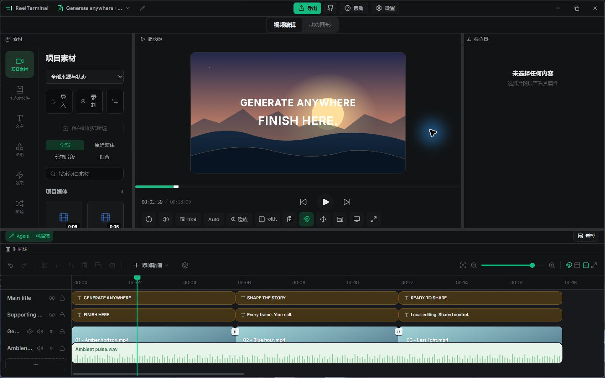
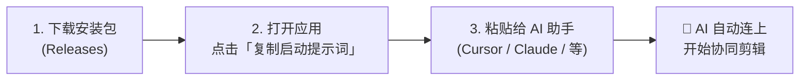
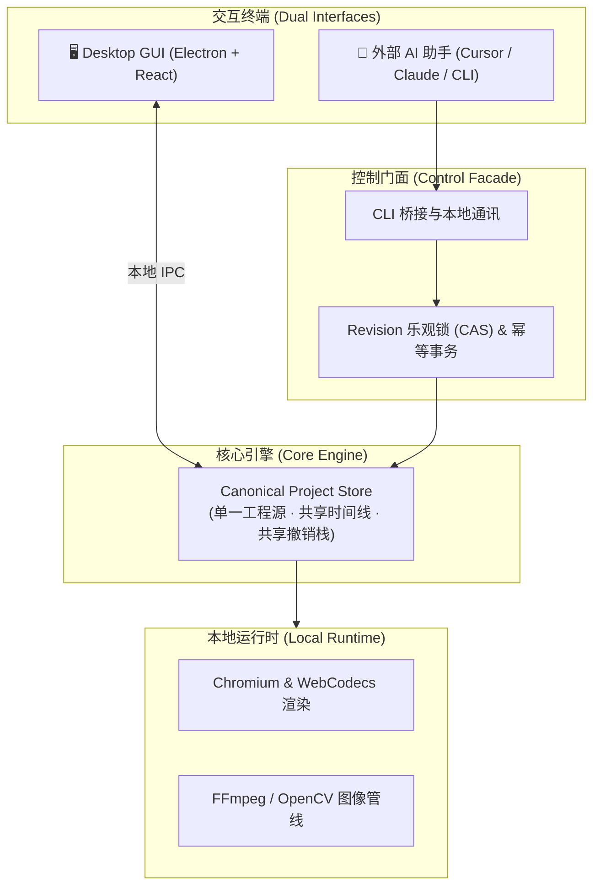

<div align="center">

[English](README_en.md) | **简体中文**


# ReelTerminal

### 面向 AI 视频生产的人机协同视频剪辑器
**生成发生在任何地方，成片交付在这里。**  
*Generate anywhere; finish here.*

<p align="center">
  <a href="https://github.com/yuchen-ya/reelterminal/releases"></a>
  <a href="docs/EXTERNAL-DEPENDENCIES.md"></a>
  <a href="apps/desktop/DISTRIBUTION.md"></a>
  <a href="https://github.com/yuchen-ya/reelterminal/issues"></a>
  <a href="LICENSE"></a>
</p>

[**🚀 快速开始**](#-快速开始-quick-start) • [**✨ 核心特点**](#-核心特点-core-features) • [**🏗️ 架构概览**](#-系统架构-architecture) • [**💬 交流与反馈**](#-交流与反馈-feedback) • [**📚 详细文档**](docs/)

</div>

---

## 💡 为什么做 ReelTerminal？

当下各类视频生成模型极大地降低了素材创作门槛，但在**碎片化的生成片段**与**最终想要的完整成片**之间，仍有很多繁琐的手工活：

* **素材零散**：生成的视频往往只有几秒，需要精准的拼接、调速、转场以及音画对位。
* **局部坏帧与瑕疵**：AI 生成的帧容易偶发闪烁、局部变形或伪影，若整段重新抽卡成本很高，更需要“定点修补”。
* **缺乏顺手的 AI 协同环境**：传统剪辑软件对大模型助手来说并不友好；而普通的脚本批处理又看不到画面、无法交互和撤销。

**ReelTerminal 试图提供一个平滑的折中解法：**  
保留现代剪辑器直观的画布和时间线，创作者可以在桌面端随手拖拽微调；同时让你的 AI 助手（Cursor、Claude、Antigravity 等）能直接操作工程时间线——**你负责直观审美，AI 负责批量与结构化处理，改动随时可撤销。**



*真实桌面界面，使用演示工程展示画布、多轨时间线与 Agent 协作状态。*

---

## ✨ 核心特点 (Core Features)

| 🤖 **面向 AI 助手协同设计** | 🎯 **真·帧精度与瑕疵修补** |
| :--- | :--- |
| 为 AI 辅助剪辑定制了严谨的时间线接口，支持原子批处理、CAS 乐观锁与防重复提交，确保 AI 助手在执行复杂剪辑时稳定可靠、不冲突。 | 基于 **0-based 解码帧索引** 与真实 PTS 时间戳，避免标称帧率导致的音画漂移。内置 OpenCV 稀疏光流追踪与掩码修复，方便定点修补 AI 瑕疵帧。 |
| 🤝 **人机双轨与共享撤销栈** | 🔒 **100% 本地优先与隐私安全** |
| 桌面 GUI 拖拽微调与 AI 助手操作实时双向同步。AI 提交的所有剪辑步骤自动进入主撤销栈，你在界面中随时可以按 `Ctrl+Z` 一键复原。 | 核心编解码、渲染管线均直接运行在本机 Chromium (WebCodecs) 与 FFmpeg，素材和工程文件全在本地，不强制上传任何云端。 |

---

## 🚀 快速开始 (Quick Start)

### 方式一：直接使用（推荐 · 无需任何开发配置）



1. 前往 **[Releases 页面](https://github.com/yuchen-ya/reelterminal/releases)** 下载对应系统的桌面端安装包；
2. 打开应用载入视频工程，点击底部状态栏的协作权限切换为 **`Agent · Editable`**；
3. 在弹出的通知中直接点击 **「复制启动提示词」**；
4. 将复制好的内容**直接粘贴发给你的 AI 助手**（如 Cursor、Claude Code、Antigravity、Windsurf 等）——提示词中已自动准备好本地环境路径与协作规则，AI 会自动接入当前项目开始协同！

本次发布提供 **Windows x64 安装包和便携 ZIP**。便携版请完整解压后运行 `ReelTerminal.exe`；macOS 安装包后续单独构建发布。Windows 构建尚未代码签名，安装时可能提示未知发布者。部分媒体处理功能需要另外安装 FFmpeg/ffprobe，详见[桌面发行说明](apps/desktop/DISTRIBUTION.md)。

---

### 方式二：开发者源码构建与启动

如果你想参与项目开发或调试源码：

```bash
# 1. 克隆代码仓库
git clone https://github.com/yuchen-ya/reelterminal.git; cd reelterminal

# 2. 安装依赖并构建 WASM 内核
corepack pnpm install; pnpm build:wasm

# 3. 构建并运行桌面端（或运行 pnpm dev 启动 Web 轻量版）
pnpm --filter @reelterminal/desktop build
pnpm --filter @reelterminal/desktop start
```

---

## 🏗️ 系统架构 (Architecture)



---

## 💬 交流与反馈 (Feedback)

ReelTerminal 目前由我一个人独立设计和开发。在日常折腾 AI 视频的过程中，深感素材碎片化与坏帧修补之苦，因而写了这个小工具，希望能让同样做 AI 视频的朋友多一种省心的选择。

项目目前还在快速迭代和打磨阶段，非常渴望得到大家的真实使用反馈：
- 遇到了 bug 或奇怪的交互体验？
- 有某个剪辑工作流特别希望得到支持？
- 对时间线或 AI 协作交互有更好的想法？

随时欢迎到 **[GitHub Issues](https://github.com/yuchen-ya/reelterminal/issues)** 提出你的想法和反馈，每一条我都会认真看！

---

## 📚 详细文档 (Documentations)

深入了解项目的具体实现与工程规范：

- 📖 [**桌面端用户手册**](docs/USER-GUIDE.md) — 桌面端安装、界面导览与常用操作。
- 🤖 [**外部 Agent 协作指南**](docs/AGENT-GUIDE.md) — 权限机制、CLI 详解与进阶接口。
- 🗂️ [**任务工作区规程**](docs/AGENT-WORKSPACE.md) — 独立工作目录规程与落盘准则。
- ⚙️ [**Command API 规范**](docs/COMMAND-API.md) — 命令目录、Schema 校验与并发控制。
- 🎞️ [**媒体审查与修复流**](docs/MEDIA-REVIEW-WORKFLOWS.md) — 逐帧提取、接触表与光流运动追踪。
- 🎨 [**色彩管理白皮书 (SDR)**](docs/COLOR.md) — BT.709 与 BT.601 颜色转换规范。

---

## ⚖️ 开源协议与鸣谢 (License & Attribution)

* 本项目核心代码基于 [MIT License](LICENSE) 开源发布。
* 本项目继承并改造自 Augustus Otu 及贡献者开源的 MIT 协议项目 [OpenReel](https://github.com/Augustus-Otu/openreel)，原始版权声明予以完整保留。
* 第三方组件、字体与模型授权审查详情请参阅 [THIRD_PARTY_NOTICES.md](THIRD_PARTY_NOTICES.md)。
