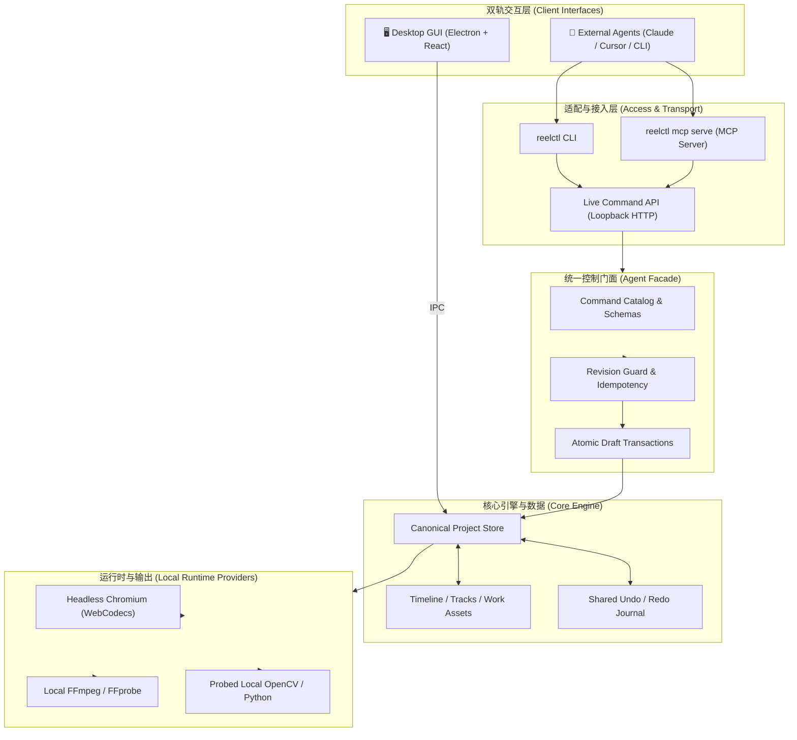

# ReelTerminal

<div align="center">

<h1>🎬 ReelTerminal</h1>

<p><strong>你的 AI 视频终点站。生成发生在任何地方，成片发生在这里。</strong></p>
<p><em>Your AI video's final stop. Generate anywhere; finish here.</em></p>

[](LICENSE)
[](package.json)
[](package.json)
[](tsconfig.base.json)
[](docs/COMMAND-API.md)
[](docs/EXTERNAL-DEPENDENCIES.md)
[](CONTRIBUTING.md)

<p>
  <a href="#-why-reelterminal">Why ReelTerminal</a> •
  <a href="#-key-features">Key Features</a> •
  <a href="#-architecture">Architecture</a> •
  <a href="#-quick-start">Quick Start</a> •
  <a href="#-agent-collaboration">Agent Collaboration</a> •
  <a href="#-monorepo-structure">Packages</a> •
  <a href="#-documentation">Documentation</a>
</p>

</div>

---

## 💡 Why ReelTerminal?

AI 视频生成模型（Sora、Runway、Kling、Luma、CogVideoX、HunyuanVideo 等）彻底重塑了创意生产，但碎片化的生成素材与最终交付的成片之间，存在一条难以逾越的鸿沟：

- **片段碎片化**：生成的视频往往长度受限、时序不连贯，需要精准拼贴、调速与音画对位。
- **不可预测性与瑕疵**：AI 生成的帧容易存在局部伪影、手部错乱或闪烁，需要定点修补（Patching）与同机位替换。
- **Agent 上下文黑盒**：外部 Agent 缺乏真实的视频工程感知能力，只能做简单的脚本批处理，无法获得像素级反馈与可撤销编辑。

**ReelTerminal 正是为此而生。**  
它将专业级非线性编辑（NLE）能力与 Agent-Native 协作架构深度融合，让**人类创作者**与**外部智能体（Claude、Cursor、Antigravity 等）**在同一时间线工程上双轨并行、共同协作。

```
 ┌───────────────────────┐         ┌───────────────────────┐
 │   人类剪辑师 (GUI)    │         │  外部智能体 (Agent)   │
 │   视觉审美 / 直观微调 │         │  结构化剪辑 / 批量分析│
 └───────────┬───────────┘         └───────────┬───────────┘
             │                                 │
             │           同源工程模型          │
             ▼    (Shared Canonical Project)   ▼
    ┌─────────────────────────────────────────────────────┐
    │       ReelTerminal Core Timeline & Revision CAS     │
    │     [ 共享撤销栈 • 乐观并发控制 • 幂等原子事务 ]    │
    └──────────────────────────┬──────────────────────────┘
                               │
                               ▼
    ┌─────────────────────────────────────────────────────┐
    │          真实本地渲染 (Chromium / WebCodecs)         │
    │          共享项目模型 • 本地渲染 • 产物验证          │
    └─────────────────────────────────────────────────────┘
```

---

## ✨ Key Features

### 🤝 人机双轨协同 (Hybrid GUI & Agent Architecture)
- **共享单一真实源 (Single Source of Truth)**：人类在 Desktop GUI 中直观拖拽，外部 Agent 通过 `reelctl` CLI 或标准 **MCP (Model Context Protocol)** 协议操作同一个项目，修改实时双向同步。
- **事务与并发保护 (Atomic Transactions & CAS)**：`edit.apply` 在原子批处理中应用时间线编辑。携带项目身份和 revision 的请求会拦截过期计划；发生冲突后需重新读取上下文并规划。
- **共享撤销历史 (Shared Undo/Redo)**：Agent 时间线编辑进入当前项目的撤销历史，可通过 GUI 撤销。个人素材库使用独立的历史；预览、分析和导出任务不会成为时间线撤销操作。

### 🎯 帧级精修与资产闭环 (Frame-Exact Repair Loop)
- **真·帧精度定位**：基于 0-based 真实解码帧索引与 PTS 时间戳，彻底告别“秒数 × 标称帧率”导致的音画漂移。
- **局部修补与光流追踪 (Mask Refine & Motion Track)**：支持 OpenCV 驱动的单帧局部补丁传播、稀疏光流追踪与矩形/掩码羽化，实现 AI 瑕疵帧的定点替换。
- **严格 CFR 替换 (Strict Replacement)**：`preserveFrames: true` 验证恒定帧率（CFR）和解码帧数是否满足替换契约；无法确认或不满足契约时拒绝替换。
- **全生命周期候选管理 (Production & Candidates)**：记录素材的生成模型、提示词、操作类型（`generation`、`redraw`、`composite` 等），支持一键对比与采纳。

### 🔒 严谨的工程模型 (Guarded Project Model)
- **项目身份检查**：live 会话跟随 GUI 当前项目，项目切换会改变 project epoch。Agent 请求需携带项目身份，避免把旧计划应用到新项目；独立 headless 会话采用单项目初始化生命周期。
- **幂等重试安全网**：内置 `idempotencyKey`，外部 Agent 在网络重发或模型重试时直接复用已提交结果，绝不发生重复追加素材。
- **输入强沙箱隔离**：内置 HTML→PNG 安全转译引擎与 SVG 严格安全过滤网关，严防外来代码注入与越权访问。

### ⚡ 本地优先与隐私无忧 (Local-First Release)
- **本地处理与可选网络资源**：导入、编辑、保存和基础导出不要求云端后端。Whisper 字幕在本机运行，但首次模型下载需要联网；分割模型等资源也可能需要下载，云视频审查则需要用户配置并明确授权（见 [EXTERNAL-DEPENDENCIES.md](docs/EXTERNAL-DEPENDENCIES.md)）。
- **明确的色彩边界**：SDR 路径识别 BT.709 与 BT.601 矩阵；WebCodecs 和 FFmpeg 导出采用各自实际使用的矩阵标签。HDR 和 10-bit 精度不在当前支持范围内（见 [COLOR.md](docs/COLOR.md)）。
- **可搬迁的数据根目录**：所有的素材、缓存与 Agent 工件均集中管理，清晰透明（详细见 [DATA-ROOT.md](docs/DATA-ROOT.md)）。

---

## 🏗️ Architecture



---

## 🚀 Quick Start

### 前置要求
以下要求用于源码开发。已打包的桌面应用和 Windows CLI 启动器使用自带的 Electron/Node 运行时，无需单独安装系统 Node.js。

- **Node.js**: `>= 22.13.0`
- **pnpm**: `11.7.0`（仓库已通过 `packageManager` 锁定）
- **Corepack**: 启用 `corepack enable`
- **FFmpeg & ffprobe**: 安装并加入系统 `PATH`（用于本地帧提取与音视频验证）

OpenCV 对齐、追踪和掩码传播另需可导入 `cv2` 与 `numpy` 的本机 Python；Blender 绑定后端是独立的可选依赖。这些工具不会自动安装，实际可用性以 `capabilities.get` 为准。

### 安装与启动

```bash
# 1. 克隆代码仓库
git clone https://github.com/yuchen-ya/reelterminal.git
cd reelterminal

# 2. 安装项目依赖
corepack pnpm install
pnpm build:wasm

# 3. 安装 Chromium 运行时内核（供自动化验证与无头渲染使用）
pnpm --filter @reelterminal/runtime-chromium exec playwright-core install chromium

# 4. 启动 Web 版视频编辑器
pnpm dev
```

### 桌面端开发与运行

```bash
# 首次安装依赖后先生成未提交 Git 的 WASM 资源
pnpm build:wasm

# 构建桌面主进程和 Web renderer
pnpm --filter @reelterminal/desktop build

# 启动桌面端应用程序
pnpm --filter @reelterminal/desktop start
```

### 自动化质量门禁

```bash
pnpm typecheck            # 全仓 TypeScript 类型检查
pnpm lint                 # 代码风格与规范审查
pnpm lint:naming          # 开源命名合规性审计 (naming-lint)
pnpm audit:dependencies   # 依赖安全漏洞与本地 patch 校验
pnpm test                 # 各包的默认 Vitest 测试，不含独立桌面 E2E 配置
pnpm --filter @reelterminal/desktop test:e2e # 构建桌面后运行独立 GUI/CLI/MCP E2E
```

---

## 🤖 Agent Collaboration

ReelTerminal 专为智能体协作设计。智能体无需关注视频编码底层细节，只需调用标准命令。

### 1. 开启协作权限
在桌面端打开任意视频工程，底部状态栏会显示当前协作状态：
- 默认状态为 **Agent · Read-only**（只读模式，允许状态读取与预览）。
- 点击状态栏按钮切换为 **Agent · Editable**（允许写入），赋予 Agent 编辑权限。
- 每次启动后首次允许编辑，右上角提示可复制当前电脑的启动提示词。它包含适用的 Shell、完整 CLI 路径和有效工作目录；修改存储位置并重启后，需要重新复制。CLI 路径跟随安装位置，工作目录跟随数据根目录或显式工作区配置。

### 2. 通过 MCP (Model Context Protocol) 接入
源码开发环境的 stdio 配置示例（请按客户端要求填写配置，并替换为本机实际路径）：

```json
{
  "mcpServers": {
    "reelterminal": {
      "command": "node",
      "args": ["/absolute/path/to/reelterminal/apps/desktop/dist/reelctl/index.js", "mcp", "serve"]
    }
  }
}
```
源码 CLI 不会自动加入全局 PATH。Windows 安装版可使用应用旁的 `reelctl.cmd`；macOS/Linux 可使用启动提示词中的完整命令。安装版的 stdio 配置与客户端调用方式见 [Agent 指南](docs/AGENT-GUIDE.md)。

### 3. CLI 快速体验 (`reelctl`)

```powershell
# 以下简写假设 reelctl 已在 PATH；否则使用 GUI 提示词中的完整命令前缀
# 查看桌面宿主连接状态与只读/写入权限
reelctl status

# 获取工程压缩上下文与当前修订号 (revision)
reelctl context --compact

# 查看准备就绪的任务需求看板
reelctl requirements list --status ready --compact

# 导入外部媒体文件并获取 mediaId
reelctl media import --path "C:/path/to/video.mp4"

# 提交原子剪辑批处理
# changes.json 必须按 live schema 填写操作和保护参数，不是一个随仓库提供的示例文件
reelctl edit apply --file changes.json
```

### 4. 任务工作区规范 (Agent Workspace)
为防止生成的文件污染源码仓库，智能体必须遵循独立的工作区规程：
1. 运行 `reelctl call capabilities.get` 获取推荐工作区根目录（默认为 `Videos/ReelTerminal/agent-workspace`）。
2. 在该目录下创建专属任务文件夹：`<recommendedRoot>/jobs/<YYYY-MM-DD>-<task-slug>/`。
3. 遵循标准化目录分层：
   - `brief.md`：任务意图与参数约定。
   - `source/`：用户原始素材（只读保全）。
   - `generated/`：AI 生成的视音频及字幕产物。
   - `work/`：处理脚本、代理文件、中间帧缓存。
   - `project/`：项目检查点、工作流和交付清单。
   - `output/`：经过校验的可交付成片。
   - `evidence/`：抽帧检查图、接触表、验证报告。

详细规程请阅读 [AGENT-WORKSPACE.md](docs/AGENT-WORKSPACE.md)。

---

## 📦 Monorepo Structure

本仓库采用 pnpm workspace 组织，各模块职责明确，高内聚低耦合：

| 模块路径 | 软件包名 | 核心职责 |
|---|---|---|
| `apps/desktop` | `@reelterminal/desktop` | Electron 桌面宿主、状态栏权限切换、跨进程 IPC 桥接与 `reelctl` 分发 |
| `apps/web` | `@reelterminal/web` | 浏览器端现代视频编辑器前端、画布交互、多轨时间线与 WebCodecs 播放器 |
| `packages/core` | `@reelterminal/core` | 规范化项目模型、状态切片、动作分发与基础编辑计算内核 |
| `packages/agent-facade` | `@reelterminal/agent-facade` | 纯 Node 跨传输层门面、统一命令目录、原子批处理翻译器与乐观并发控制 |
| `packages/agent-transport` | `@reelterminal/agent-transport` | 独立 CLI / MCP 服务端与无头执行入口 (`reelterminal-agent`) |
| `packages/runtime-chromium` | `@reelterminal/runtime-chromium` | 基于 Headless Chromium 的离线帧渲染、H.264 导出与工件技术核验 |
| `packages/ui` | `@reelterminal/ui` | 共享的前端 UI 设计系统与核心组件库 |
| `packages/creation-core` | `@reelterminal/creation-core` | 高性能 C++ 视频创作底层计算库与原生渲染管线 |
| `apps/studio` | `@reelterminal/studio` | *（实验性）* 本地特效实验室与视觉滤镜工作台 |
| `apps/image` | `@reelterminal/image` | *（实验性）* 图像编辑器（使用独立 AGPL-3.0 抠图引擎） |

---

## 📚 Documentation

完整的产品设计、接口规范与架构文档：

- 📖 **用户与操作指南**
  - [桌面端用户上手手册](docs/USER-GUIDE.md) — 零门槛桌面安装、剪辑导览与离线帮助。
  - [外部 Agent 协作指南](docs/AGENT-GUIDE.md) — 权限切换、CLI 使用与 MCP 接入协议。
  - [Agent 任务工作区规范](docs/AGENT-WORKSPACE.md) — 独立工作目录规程与落盘安全准则。
  - [Agent 统一工作流定义](SKILL.md) — 核心编辑技能与标准命令提示词。
- ⚙️ **系统架构与接口契约**
  - [Command API 完整规范](docs/COMMAND-API.md) — 统一命令注册表、Schema 探查与校验。
  - [生产流程与候选管理 (M3)](docs/PRODUCTION-MANAGEMENT.md) — 生产谱系、候选对比、审查任务与批量分析。
  - [色彩管线白皮书 (SDR)](docs/COLOR.md) — sRGB / BT.709 / BT.601 颜色转换规范。
  - [媒体审查与替换工作流](docs/MEDIA-REVIEW-WORKFLOWS.md) — 逐帧提取、接触表与光流运动追踪。
  - [掩码精细化与短补丁传播](docs/MASK-PROPAGATION.md) — OpenCV 局部修复与候选采纳流程。
  - [命名与兼容性规范](docs/NAMING-AND-COMPATIBILITY.md) — 标识符映射与上游数据格式兼容。
  - [外部网络与依赖声明](docs/EXTERNAL-DEPENDENCIES.md) — 离线运行保障与可选网络访问白名单。
- 📦 **分发与合规**
  - [桌面端打包与分发手册](apps/desktop/DISTRIBUTION.md) — 多平台打包、签名要求与二进制依赖。
  - [第三方资产与字体权利审查](docs/ASSET-LICENSE-REVIEW.md) — 开源资产、字体、模型授权审查报告。
  - [第三方许可证声明](THIRD_PARTY_NOTICES.md) — 第三方依赖与版权归属说明；[分发审查记录](apps/desktop/LICENSES/RELEASE-READINESS.md)说明许可材料来源、仍待确认的版权通知与签名验证状态。

---

## 🤝 Contributing & Security

欢迎所有旨在提升剪辑体验与智能体协同能力的贡献！

- **提交代码**：请先阅读 [CONTRIBUTING.md](CONTRIBUTING.md)，确保通过 `pnpm typecheck`、`pnpm lint:naming` 及相关单元测试。
- **安全报告**：涉及权限绕过、越权读写或安全漏洞，请通过 [GitHub Security Advisory](https://github.com/yuchen-ya/reelterminal/security/advisories/new) 私下提交，详情见 [SECURITY.md](SECURITY.md)。

---

## ⚖️ License and Attribution

- ReelTerminal 核心代码基于 [MIT License](LICENSE) 开源发布。
- 本项目继承并深度改造自 Augustus Otu 及贡献者开源的 MIT 协议项目 [OpenReel](https://github.com/Augustus-Otu/openreel)。原始版权声明予以完整保留，见 [`LICENSE`](LICENSE)。
- 本项目包含部分独立许可的第三方组件、字体和可选开发工具，具体条款请查阅 [`THIRD_PARTY_NOTICES.md`](THIRD_PARTY_NOTICES.md)。
- 实验性 Image 应用使用独立 AGPL-3.0 许可的 `@imgly/background-removal`；根目录 MIT 许可不替代第三方条款。许可材料与安装包签名是不同事项：源码开源无需购买签名证书；未签名 Windows 测试版需明确标注状态和安装限制，正式安装体验及 macOS 公证见[分发指南](apps/desktop/DISTRIBUTION.md)。

---

<div align="center">

**ReelTerminal — 让每一次 AI 灵感，都能以最完美的姿态成片。**

Made with ❤️ by [yuchen-ya](https://github.com/yuchen-ya) and open-source contributors.

</div>
