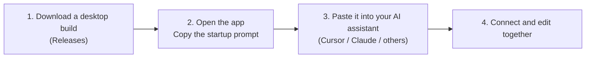
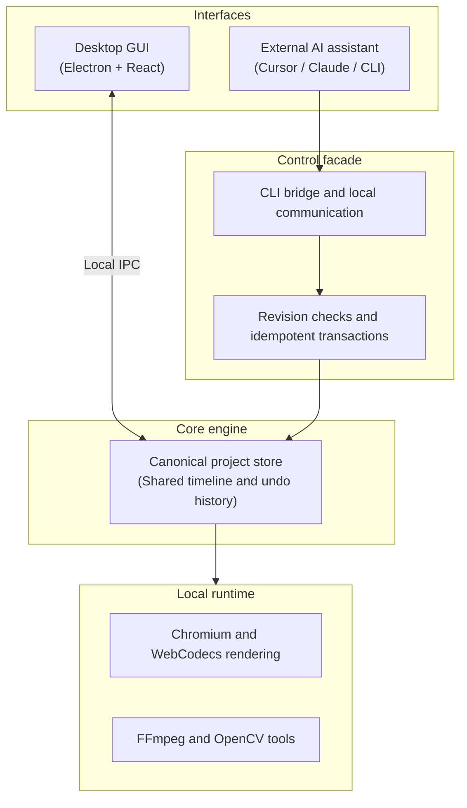

<div align="center">

**English** | [简体中文](README.md)


# ReelTerminal

### A collaborative video editor for people and AI assistants
**Generate anywhere; finish here.**

<p align="center">
  <a href="https://github.com/yuchen-ya/reelterminal/releases"></a>
  <a href="docs/EXTERNAL-DEPENDENCIES.md"></a>
  <a href="apps/desktop/DISTRIBUTION.md"></a>
  <a href="https://github.com/yuchen-ya/reelterminal/issues"></a>
  <a href="LICENSE"></a>
</p>

[**🚀 Quick start**](#-quick-start) • [**✨ Core features**](#-core-features) • [**🏗️ Architecture**](#-architecture) • [**💬 Feedback**](#-feedback) • [**📚 Documentation**](docs/)

</div>

---

## 💡 Why ReelTerminal?

AI video models make it easier to create footage, but turning **a collection of generated clips** into **a finished video** still takes a lot of manual work:

* **Scattered footage:** short generated clips need precise cuts, timing adjustments, transitions, and audio alignment.
* **Bad frames and artifacts:** flicker, distorted shapes, and other defects often affect only a small part of a clip. Repairing that section can be more practical than generating the whole shot again.
* **Awkward AI collaboration:** traditional editors are difficult for an AI assistant to operate, while batch scripts offer little visual feedback, interaction, or undo.

**ReelTerminal brings a visual editor and an assistant-friendly timeline together.** Drag and adjust clips in the desktop app, or let your AI assistant—Cursor, Claude, Antigravity, and others—operate the same project. **You make the creative decisions; the assistant handles repetitive and structured edits. Changes remain undoable.**


*A real desktop screenshot using a demo project, showing the canvas, multiple timeline tracks, and Agent collaboration status.*

---

## ✨ Core features

| 🤖 **Designed for AI collaboration** | 🎯 **Frame-accurate review and repair** |
| :--- | :--- |
| A structured timeline API supports atomic batches, revision checks, and duplicate-request protection, helping assistants apply edits without conflicting with ongoing work. | Uses **zero-based decoded frame indexes** and actual presentation timestamps rather than relying only on nominal frame rates. OpenCV sparse optical flow and mask tools support targeted repairs. |
| 🤝 **Shared project and undo history** | 🔒 **Local-first editing** |
| Desktop gestures and assistant edits update the same project. Assistant edits enter the main undo history, so you can undo them from the editor. | Core decoding, rendering, and export run locally through Chromium, WebCodecs, and FFmpeg. Projects and media stay on your machine; no cloud upload is required for local editing. See the external-dependencies guide for optional integrations and resource downloads. |

---

## 🚀 Quick start

### Option 1: Use the desktop app



1. Visit **[Releases](https://github.com/yuchen-ya/reelterminal/releases)** and download an available desktop build for your system.
2. Open a video project, then switch the collaboration control in the bottom status bar to **`Agent · Editable`**.
3. Click **“Copy startup prompt”** in the notification.
4. **Paste the prompt into your AI assistant**, such as Cursor, Claude Code, Antigravity, or Windsurf. It includes the local paths and collaboration rules needed to connect to the open project.

This release includes a **Windows x64 installer and portable ZIP**. Extract the entire ZIP before running `ReelTerminal.exe`. macOS builds will follow separately. The Windows builds are unsigned and may show an unknown publisher during installation. Some media-processing features require a separate FFmpeg/ffprobe installation; see [desktop distribution](apps/desktop/DISTRIBUTION.md).

---

### Option 2: Build from source

To contribute or debug the app, use Node.js 22.13.0 or newer and Corepack with the repository-pinned pnpm version:

```bash
# 1. Clone the repository
git clone https://github.com/yuchen-ya/reelterminal.git
cd reelterminal

# 2. Install dependencies and build the WASM modules
corepack pnpm install
corepack pnpm build:wasm

# 3. Build and start the desktop app
corepack pnpm --filter @reelterminal/desktop build
corepack pnpm --filter @reelterminal/desktop start

# Alternatively, start the web editor with: corepack pnpm dev
```

See [CONTRIBUTING.md](CONTRIBUTING.md) for development checks and optional tool setup, and [desktop distribution](apps/desktop/DISTRIBUTION.md) for packaging instructions.

---

## 🏗️ Architecture



---

## 💬 Feedback

I'm building ReelTerminal as a personal project. While working with AI video, I kept running into scattered footage and frames that needed small repairs. This tool grew out of wanting a more convenient way to finish those videos.

The project is still evolving, and feedback from people using it matters to me:

* Found a bug or an awkward interaction?
* Have an editing workflow you would like supported?
* Have ideas for the timeline or collaboration with an AI assistant?

Please share them through **[GitHub Issues](https://github.com/yuchen-ya/reelterminal/issues)**. Reports in English are welcome, and I read every one. For security vulnerabilities, use the private reporting route in [SECURITY.md](SECURITY.md).

---

## 📚 Documentation

Some guides are currently in Chinese; command names and code examples are shared across both interfaces.

* 📖 [**Desktop user guide**](docs/USER-GUIDE.md) — installation, interface tour, and common operations. Desktop builds include English and Chinese offline manuals.
* 🤖 [**External Agent guide**](docs/AGENT-GUIDE.md) — access modes, CLI usage, and advanced commands.
* 🗂️ [**Agent workspace guide**](docs/AGENT-WORKSPACE.md) — task directories and output-file conventions.
* ⚙️ [**Command API specification**](docs/COMMAND-API.md) — commands, schema validation, and concurrency control.
* 🎞️ [**Media review and repair workflows**](docs/MEDIA-REVIEW-WORKFLOWS.md) — frame extraction, contact sheets, and optical-flow tracking.
* 🎨 [**SDR color management**](docs/COLOR.md) — BT.709 and BT.601 color conversion.
* 🌐 [**External dependencies**](docs/EXTERNAL-DEPENDENCIES.md) — public resource downloads and optional network integrations.

---

## ⚖️ License and attribution

* The project's core code is available under the [MIT License](LICENSE).
* ReelTerminal builds on the MIT-licensed [OpenReel](https://github.com/Augustus-Otu/openreel) project by Augustus Otu and contributors. The original copyright notice is preserved.
* Separately licensed components, fonts, and model resources are documented in [THIRD_PARTY_NOTICES.md](THIRD_PARTY_NOTICES.md).
